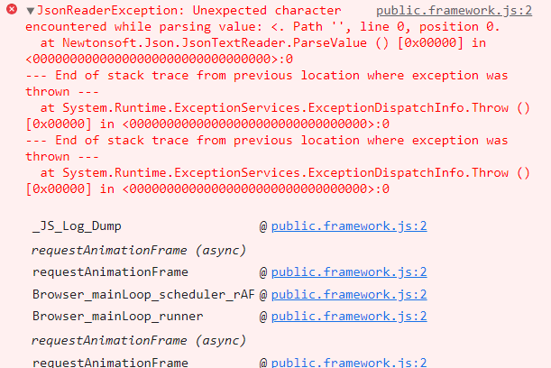
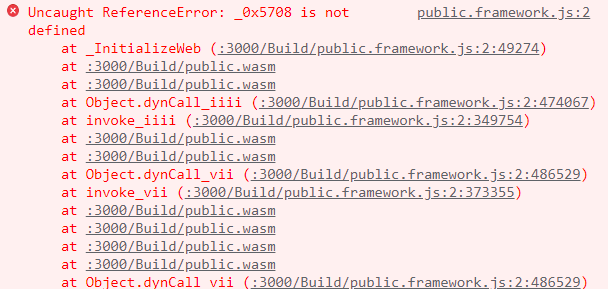

### 유니티 웹 통신 시행착오

1. react-unity-webgl 사용(https://www.npmjs.com/package/react-unity-webgl)

2. 기존에 팀원이 파이어베이스 연동해놓은 방식과 달라 파베 기능들을 사용할 수 없는 문제가 발생함.

   1. 기존 파베는 아래와 같이 index.html에서 유니티 인스턴스를 만들어주고 유니티의 jslib 함수에서 유니티 인스턴스를 찾아 SendMessage를 사용함.

      ```html
      var script = document.createElement("script");
            script.src = loaderUrl;
            script.onload = () => {
              createUnityInstance(canvas, config, (progress) => {
                progressBarFull.style.width = 100 * progress + "%";
              })
                .then((unityInstance) => {
                  window.unityInstance = unityInstance;
                  loadingBar.style.display = "none";
                  fullscreenButton.onclick = () => {
                    unityInstance.SetFullscreen(1);
                  };
                })
                .catch((message) => {
                  alert(message);
                });
            };
      ```

   2. react-unity-webgl의 경우 App.js에서 패키지 자체의 유니티 컴포넌트를 사용함. 컴포넌트 내부에서 유니티 인스턴스가 작동하며, Index.html의 컴포넌트가 아니라 인스턴스에 접근이 불가능함.

      1. 유니티 인스턴스를 사용하긴 했고, 기존 유니티 인스턴스를 만들때 캔버스를 사용했기에 유니티 캔버스를 비롯해 온갖 컴포넌트를 지정해 SendMessage를 사용해봤지만 작동하지 않음.

   3. 인스턴스를 찾는 방법을 찾는 데에 하루를 사용했고, 시간이 얼마 남지 않아 다른 방법을 강구. 파이어베이스는 유니티 WebGL에서 rest api를 사용할 수 없었는데, 사용가능하게 해주는 에셋을 발견함. 유니티 내부에서 api요청은 기존에 사용하고 있었으므로 api사용이 가능해진다면 개발이 쉬워짐.

      1. 에셋 가격이 16만에 이르러 사전조사를 위해 개발자와 접촉함.

         1. 인스턴스를 만드는 것이 문제였으므로 index.html에서 인스턴스를 만들어서 사용하는가를 확인함.

            1. 빌드파일의 경로만 지정해주면 된다고 함. react-unity-webgl도 빌드파일 경로만 지정했었으므로 호환될 것으로 추정. 인스턴스는 기존 파베 연동방식에서 필요했던 것이고, 새 에셋은 api 사용이 가능하므로 인스턴스가 필요하지 않을것으로 추정.

         2. 구매해봄. 로컬에서 테스트.

            1. 로컬 유니티 에디터에서 정상작동

            2. 빌드앤런으로 웹에서 테스트해도 정상작동

            3. react-unity-webgl에 빌드파일 경로를 지정해주고 리액트에 삽입했더니 파이어베이스 기능 작동X

               

               이 에셋을 사용했을 때 유니티 빌드에서 빌드폴더 뿐 아니라 StreamingAssets 폴더가 생기며, 그 폴더에 파이어베이스 관련 파일이 들어가있음. 그렇다면 StreamingAssets폴더 혹은 에러메시지처럼 Newtonsoft의 Json파싱에 문제가 있거나 StreamingAssets 폴더가 없는게 문제가 아닐까?

               1. json 관련 문제는 검색해봐도 다들 파싱문제만 얘기함. 나는 Newtonsoft를 사용한 적이 없고 에셋에 들어있으니 아마 에셋측의 문제일것. 그러므로 json 파싱문제를 단시간 내에 직접 해결하긴 어렵다고 판단.

               2. react-unity-webgl에서 빌드파일 경로를 지정해주는 클래스의 상세를 살펴보니 StreamingAssets도 인자에 있음. 경로를 지정해주자.

                  ```react
                  const unityContext = new UnityContext({
                    loaderUrl: "Build/public.loader.js",
                    dataUrl: "Build/public.data",
                    frameworkUrl: "Build/public.framework.js",
                    codeUrl: "Build/public.wasm",
                    streamingAssetsUrl: "StreamingAssets",
                  });
                  ```

               3. 빌드파일에서 에러 발생. 빌드파일 에러는 직접 수정하기 어렵다고 판단. 에셋 사용 포기.
               
                  

3. 이제 그냥 파이어베이스 계정 기능 전부 포기하자는 의견이 나옴.
   1. 몇시간만 더 달라고 함. 기존 파베 연동때 jslib 사용하는 방식을 다시 확인해봄.
   
   2. jslib에서 document에는 접근할 수 있으나 함수 인자를 리액트 js함수에 전달할 방법을 찾지 못함.
   
   3. 안쓰는 div태그를 만들어서 jslib을 통해 div태그의 className을 수정함. 리액트 js함수 안에서 쿼리셀렉터를 통해 해당 div태그의 className을 감시하다가 이름이 바뀌면 인자로 사용하도록 함. 꼼수로 해결.
   
      ```js
      // 유니티 내 Jslib파일
      mergeInto(LibraryManager.library, {
        CallCam: function (data) {
          var dataname = Pointer_stringify(data);
          var bb = document.querySelector("#root"); 
          bb.className = dataname; 
          console.log("Jslib uid " + dataname);    
        },
        SelectControl: function (mode) {
          var modename = Pointer_stringify(mode);
          var qq = document.querySelector("#controlmode"); 
          qq.className = modename;
          console.log("Jslib mode " + modename);
        }
      });
      ```
   
      ```react
      const id_class = document.querySelector("#root");
      const id_mode = document.querySelector("#controlmode");
      const handleObserveClick = async () => {
          var caputuring = setInterval(async () => { // setInterval로 무한루프
            if (id_class.className !== "test") { // 엘리먼트 클래스네임에 따라 분기
              id_class.style.display = "block";
              const stream = new MediaStream(webcamRef.current.stream);
              const track = stream.getVideoTracks()[0];
              const image = new ImageCapture(track);
      
              const blob = webcamRef.current.getScreenshot();
              const form = new FormData();
              form.append("image", blob);
              var sub_uid = id_class.className; // 엘리먼트 클래스네임을 인자로 사용
              var sub_mode = id_mode.className;
              if (sub_uid !== "test") {
                const url_sub = ssafy_sub + sub_uid + "/" + sub_mode + "/";
                const { data } = api.post(url_sub, form);
              }
            } else if (id_class.className === "test") {
              id_class.style.display = "none";
            }
          }, 250);
        };
      ```
   
      

